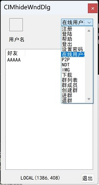

<h1 align = "center">MyAutomatic</h1>

[](https://github.com/tsymiar/MyAutomatic/actions/workflows/cmake-multi-platform.yml)
[](https://tsymiar.visualstudio.com/MyAutomatic/_build/latest?definitionId=70&branchName=auto-dev)
[](https://app.codacy.com/gh/tsymiar/MyAutomatic/dashboard?utm_source=gh&utm_medium=referral&utm_content=&utm_campaign=Badge_grade)
[](https://opensource.org/licenses/Apache-2.0)
[](https://996.icu)

##### This is **_`MyAutomatic`_**, clone with

```c
git clone https://github.com/tsymiar/MyAutomatic.git
```

##### _includes sub-projects below ⇣⇣⇣_

LinxSrvc
-------

* Brief

    Building all executes `./build.sh all -j` command. Using `./build.sh test` to test, deleting caches using `./build.sh clean`.

    Once when generates _SUCCESS_, some binary files will shown in the _bin_ / _gen_ directories, such as:

    [_bin_]

    ```c
    chstest
    chigpio
    mes909
    pipefifo
    VideoCapture
    imagesnap
    IM.exe
    Client.exe
    kaics.exe
    pthdtest.exe
    gSOAPverify(myweb.wsdl)
     ```

    [_gen_]

     _`gn` / `webevent_server`_

* Description

  *
       | chstest | chigpio | mes909 | pipefifo |
       | :------:| :--: | :----: | :-------:|

       Some scattered _`*.c`_ files is driver of **hardware**s such as `GPIO`, `ME909S-821`(_a Huawei `LTE 4G` network module_), `pipe`/`fifo` _etc._; _chstest_ is a test to _chsdev_ driver.

  * VideoCapture | imagesnap

      _VideoCapture_ is a video capture program based on **v4l2** which should _only_ able to run on linux.

      _imagesnap_ is a photo take*r*, could running on linux _only_.

  * IM.exe | Client.exe

      [_`IM.exe`_](https://raw.githubusercontent.com/tsymiar/MyAutomatic/auto-dev/LinxSrvc/IM/IM.cc) is a simple `instant-messaging` chat room, use it by register, login, send command and _a small amount of quantity_ messages.

      `Client.exe` is a client peer implement of an _online chat_ room.

      

  * kaics.exe

      a _sub-pub_ message queue(_`MQ`_), which can penetrate the intranet, more info linked can get from [_here_](https://github.com/tsymiar/MyAutomatic/blob/auto-dev/LinxSrvc/IM/readme.md).

  * pthdtest.exe

      a thread pool based on `pthread`.

  * gSOAPverify

      a `SOAP-server` which is to verify login using the config file _myweb.wsdl_.

  * gn

      a _cross-platform_, _big/small endian_, _increasing/decreasing_ binary number generator.

  * webevent_server

      a http server and client package library, depends on `libevent`.

QtCases
-------

* [_`It`_](https://github.com/tsymiar/MyAutomatic/tree/auto-dev/QtCases) is a test-case using _`Qt`_, _`OpenGL`_. using _`mkallcase.sh`_ to build it.
  
## WinNTKline

##### [Microsoft .NET Framework 3.5](https://aka.ms/msbuild/developerpacks) is needed if compile WinNTKline

| CvMlwk |
|:----:|

> _`OpenCV`_ && some _`Machine Learning`_ learning cases.

| KlineUtil |
|:-------:|

> A MFC solution to _register_, catch files, show _K-line_, simulate _ctp_ ... _etc._

| WPFKline |
|:--------:|

> A K-line application using _`C#`_.

| TestUtils |
|:--------:|
> A testcases to test files of _KlineUtil_ .

-------

#### _**I**mpact of the program has built in [`Market`]:_


