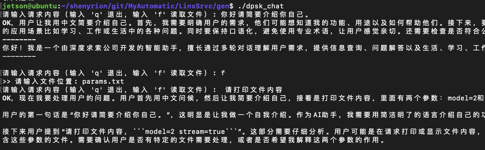
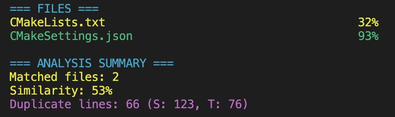
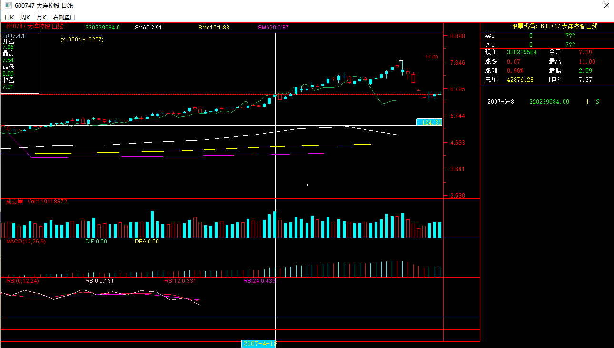

<h1 align="center">MyAutomatic</h1>

[](https://github.com/tsymiar/MyAutomatic/actions/workflows/cmake-multi-platform.yml)
[](https://tsymiar.visualstudio.com/MyAutomatic/_build/latest?definitionId=70&branchName=auto-dev)
[](https://app.codacy.com/gh/tsymiar/MyAutomatic/dashboard?utm_source=gh&utm_medium=referral&utm_content=&utm_campaign=Badge_grade)
[](https://opensource.org/licenses/Apache-2.0)
[](https://996.icu)

##### This is **_`MyAutomatic`_**, getting by

```sh
git clone https://github.com/tsymiar/MyAutomatic.git
```

##### _includes sub-projects below ⇣⇣⇣_

LinxSrvc
--------

* Brief

    Build all executables with `./build.sh all (-j)`. Use `./build.sh test` to test, and `./build.sh clean` to delete caches.

    Once generated _SUCCESSFULLY_, some binary files will appear in the _bin_ / _gen_ directories, such as:

    [_bin_]

    ```c
    chstest chigpio mes909 pipefifo
    rdma_server.exe rdma_client.exe
    VideoCapture imgfilesnap.exe
    IM.exe client.exe
    kaics.exe (kaics.cfg)
    gSOAPverify (myweb.wsdl)
    test_phm2f.exe
    pthdtest.exe
    ```

    [_gen_]

    ```c
    analyzing dpsk_chat
    gn1 lookup seekTimeTest
    trans_server trans_client
    video_render webevent_server
    ```

* Description

    | chstest | chigpio | mes909 | pipefifo |
    | :------: | :-----: | :----: | :------: |

    Some scattered _`*.c`_ files are drivers for **hardware** such as `GPIO`, `ME909S-821` (_a Huawei `LTE 4G` network module_), `pipe`/`fifo`, etc. _chstest_ is a sample for the _chsdev_ driver.

    * VideoCapture | imgfilesnap

        _VideoCapture_ is a video capture program based on **v4l2** and runs _only_ on Linux.

        _imgfilesnap_ is a photo take*r*, also runs only on Linux.

    * IM.exe | client.exe

        [_`IM.exe`_](https://raw.githubusercontent.com/tsymiar/MyAutomatic/auto-dev/LinxSrvc/IM/IM.cc) is an `instant-messaging` chat room demo. Use it to register, login, send commands, and send _a small number_ of messages.

        _client.exe_ is a client peer implementation of an _online chat room_ with menus as below.

    * kaics.exe

        A _sub-pub_ message queue (_`MQ`_), which can penetrate the intranet. More info can be found [here](https://github.com/tsymiar/MyAutomatic/blob/auto-dev/LinxSrvc/IM/readme.md).

    * gSOAPverify

        A `SOAP-server` used to verify login using the config file _myweb.wsdl_.

    * rdma_server.exe | rdma_client.exe

        _`RDMA`_ is a library for developing `TCP/IP`/`Rocket Direct` based applications, using _librdmacm.so_.

    * test_phm2f

        A tiny test to show _`phy_mem.ko`_ usage.

    * pthdtest.exe

        A thread pool based on `pthread`.

    * gn1

        A _cross-platform_, _big/small endian_, _increasing/decreasing_ binary number generator.

    * dpsk_chat

        A mini chat tool using the _`DeepSeek`_ API to answer questions, which is one of the most popular question answering systems. Modify _params.txt_ to set key-value pairs, such as model, stream, etc.

        

    * video_render

        A video decode demo using `ffmpeg`/`multimedia` (Jetson Orin Nano).

    * webevent_server

        Is an HTTP server and client message manager, depends on `libevent`.

    * analyzing

        A code tool to compare differences between two same-named files or different directories.

        

    * trans_server | trans_client

        [_`UDP`_/_`TCP`_] transfer client/server using _C++11_, supports file transfer and multi-connect.

    * lookup / seekTimeTest

        The _lookup_ is a tool to find pattern by `regex` using `kmp`/`manacher` algorithm. _seekTimeTest_ is a tool to seek data offsets by gaven times. If time offsets are not found in the database, it reads the given data file. The _time.cfg_ is a demo config file to set seeking timestamps.

    There are more tools, check _sometools_.

QtGames
-------

* [_`It`_](https://github.com/tsymiar/MyAutomatic/tree/auto-dev/QtGames) is a test-case using _`Qt`_, _`SDL`_ and _`OpenGL`_. Use _mkallcase.sh_ to build it.
  
## WinNTKline

##### [Microsoft .NET Framework 3.5](https://aka.ms/msbuild/developerpacks) is needed to compile WinNTKline

| CvMlwk |
|:------:|

> _`OpenCV`_ and some _`Machine Learning`_ learning cases.

| KlineUtil |
|:---------:|

> Utils for `cef-browser`, security libs, show _K-line_ by GL, simulate `CTP`, etc.

| WPFKline |
|:--------:|

> A K-line application using _`C#`_.

| TestUtils |
|:---------:|

> Test cases to test the interface of _KlineUtil_.

-------

#### _**I**mpact of the program has built in [`Market`]:_


