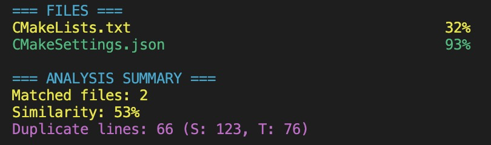
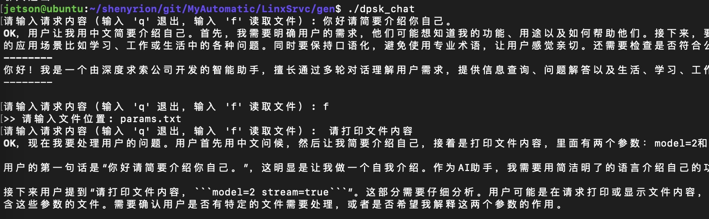
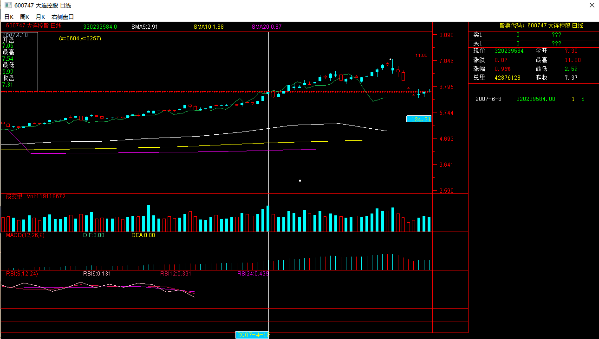

<h1 align="center">MyAutomatic</h1>

[](https://github.com/tsymiar/MyAutomatic/actions/workflows/cmake-multi-platform.yml)
[](https://tsymiar.visualstudio.com/MyAutomatic/_build/latest?definitionId=70&branchName=auto-dev)
[](https://app.codacy.com/gh/tsymiar/MyAutomatic/dashboard?utm_source=gh&utm_medium=referral&utm_content=&utm_campaign=Badge_grade)
[](https://opensource.org/licenses/Apache-2.0)
[](https://996.icu)

> A hands-on playground for **systems code**: instant messaging, a `SOAP` service, an `HTTP`/`WebSocket` server, Linux hardware and kernel drivers, `RDMA`, plus `Qt` / `C#` / `Python` / `Swift` side projects — all driven by one script.

```sh
git clone https://github.com/tsymiar/MyAutomatic.git
```

##### _top-level ⇣⇣⇣_

| Directory | Stack | What lives there |
| :-- | :-- | :-- |
| 🐧 [LinxSrvc](#linxsrvc) | C / C++ / Python / Swift | the main project — services, drivers and tools (see the categories below) |
| 🎮 [QtGames](#qtgames) | `Qt` 5/6 Widgets + `SDL2` + `OpenGL` | one desktop app: a flappy-triangle OpenGL scene, the _Echo Resonance_ puzzle game, and optional WPS embedding |
| 🪟 [WinNTKline](#winntkline) | `C#` / `WPF` / `MFC` / `C++` (**Windows**) | K-line desktop apps and their utility libs; its solution also builds several `LinxSrvc` and `QtGames` projects |
| 🛒 Market | prebuilt `.exe` | demo binaries kept as built (`MarketClient.exe`, `vcredist_x86.exe` + the matching debug CRT) |
| 🧰 toolset | Shell / Python | standalone helpers — `similary.py` (comparison backend, symlinked into the VSCode extension as `similarity.py`), `matkline.py` (draws K-line figures), `mdprint.py`, `openwebui.sh`, plus cache (`clcache.sh`) / git (`gitfast.sh`) helpers |

Windows-only helpers live at the root: `choose.bat` / `choose.ps1` set the dependency environment variables interactively (`BOOST`, `CEFDIR`, `QTDIR`, `OPENCV`, `OPENSSL`, `ZLIB`, `libPNG`, `SDL2`, …), `clean.bat` deletes every artifact directory, and `MyAutomatic.vbs` / `MyAutomatic.lnk` open `WinNTKline/WinNTKline.sln`.

### 🛠️ Build &amp; test

| Goal | Command |
| :-- | :-- |
| 🏗️ Build everything | `./build.sh all -j` |
| 🧪 Unit tests + `lcov` coverage | `./build.sh test` |
| 🧹 Remove caches and artifacts | `./build.sh clean` |
| 🔨 Build a single CMake sub-project | `./build.sh <dir>` — e.g. `./build.sh lookup` |
| 🎨 Build the Qt desktop app | `./build.sh QtGames/` (any argument starting with `Qt` is handed to `qmake`) |

`./build.sh` prepares four artifact directories up front: `bin/`, `gen/`, `out/` (intermediates) and `kos/` (kernel modules). GitHub Actions (`.github/workflows/cmake-multi-platform.yml`) and Azure Pipelines (`azure-pipelines.yml`) run exactly those three commands (`all -j`, `QtGames/`, `test`) on every push to `auto-dev`.

Third-party sources sit in `LinxSrvc/3rd/` as submodules (`googletest`, `rdma-core`, `rxe-dev`, `json`, `lcov`); `./build.sh test` fetches the ones it needs (`librdmacm`/`libverbs`, `libevent`, `libwebsockets`, SQLite, `ffmpeg`, `SDL2` and friends are expected on the host and pulled in by the sub-projects when missing).

---

LinxSrvc
--------

`./build.sh all` runs two independent chains — the top-level `Makefile` chain and the top-level `CMakeLists.txt` chain — so artifacts end up in one of two directories:

| Output | Artifacts |
| :-- | :-- |
| `bin/` (Make chain) | `IM.exe`, `client.exe`, `kaics.exe` (`kaics.cfg`), `gSOAPverify` (`myweb.wsdl`), `pthdtest.exe`, `VideoCapture`, `imgfilesnap.exe`, `chstest`, `chigpio`, `mes909`, `pipefifo`, `dirtyhack`, `test_phm2f.exe`, `rdma_server.exe`, `rdma_client.exe` |
| `gen/` (CMake chain) | `lookup`, `genSeek`, `seek_test`, `lookup_test_v2` (`time.cfg`, `libtimeUtil.so`), `diffs`, `gn1`, `e.g`, `webevs_serve`, `mocking_main`, `mocking_client`, `dpsk_chat` (`params.txt`), `video_render` (`check.sh`), `sudoku-*.whl`, `similarity-*.vsix` |
| `kos/` | `chsdev.ko`, `virtexdrv.ko`, `phy_mem.ko` — kernel modules copied there by `hdware` (Linux + kernel headers only) |

### 💬 Messaging &amp; networking

* **IM.exe | client.exe**

    [_`IM.exe`_](https://raw.githubusercontent.com/tsymiar/MyAutomatic/auto-dev/LinxSrvc/IM/IM.cc) is an `instant-messaging` chat room demo: register, login, send commands, and exchange _a small number_ of messages. It forks a child per connection, listens on `argv[1]` (default `8877`), and `-m` / `-x` print / reset the shared-memory online table.

    _client.exe_ is the chat-room peer with its own menus. Its sources live outside this folder (`WinNTKline/KlineUtil/IM/client.cc` and `WinNTKline/IMclient/imclient.cpp`), so it only builds when that sibling project is checked out too.

* **kaics.exe**

    A _sub-pub_ message queue (_`MQ`_) that can penetrate the intranet — the `KaiTest` CLI linked against `KaiSocket` (`-S` / `-C` / `-BK` / `-SS [topic]` / `-PB [topic] [msg]` / `-TF [topic] [file]`, endpoint from `kaics.cfg`, default `127.0.0.1:9999`). The Makefile route is `make IM Kai client` inside `LinxSrvc/IM`; alternatively `./build.sh IM` uses `IM/CMakeLists.txt` and produces the shared library `libkaics.so` plus the `kaics.exe` CLI. On Windows it is compiled by the `Scadup` project of the WinNTKline solution. More in [its readme](https://github.com/tsymiar/MyAutomatic/blob/auto-dev/LinxSrvc/IM/readme.md).

* **webevs_serve**

    HTTP + WebSocket server built on `libevent` (HTTP) and `libwebsockets` (WS). Run `./webevs_serve <http_port> [ws_port]`, or set `WEBEV_WS_PORT` for the second port; a non-numeric first argument is treated as a URL and issues a single `RequestClient` probe instead. The HTTP listener also serves a static frontend, taken from another git branch — `WEBEV_FRONTEND="branch[:dir]"` (default `gh-pages:./webevs-frontend`, `0` disables it), with `WEBEV_REPO` pointing at the repository. It is built by `make -C webevs build` (passing `-DAPPOINT_EVENT=/usr/local`); without `libevent` no target is produced, and without `libwebsockets` the WS half is left out.

* **gSOAPverify**

    A `SOAP` server that verifies logins against the contract in `myweb.wsdl`.

* **mocking_main | mocking_client**

    [_`UDP`_/_`TCP`_/multicast] throughput tool pair in _C++11_. Both come from the same `socket.cpp`, split by the `CLIENT` macro — useful as a baseline when sizing the `Mac/Transfer` and KaiSocket paths.

* **rdma_server.exe | rdma_client.exe**

    _`RDMA`_ sample pair for `TCP/IP` / `Rocket Direct` applications, on top of _librdmacm.so_.

### 🔍 Search, data generation &amp; code analysis

* **lookup | genSeek | seek_test | lookup_test_v2**

    _lookup_ searches recorded streams with `kmp` / `manacher` (`lookup <filePath> [pattern]`, default = longest palindrome). _genSeek_ emits synthetic frames to test with. The two `*test*` binaries exercise the time-index engine from one shared `lookup/test/main.cpp`: _seek_test_ covers generation V1 (`seek/`), _lookup_test_v2_ covers V2 (`time/`, built with `-DTIMESEEK`). `time.cfg` and `libtimeUtil.so` land in _gen_ as well — index/query go through SQLite and silently no-op when built without `USE_SQLITE3` (the -dev package is auto-installed when `apt-get` exists; otherwise every DB call fails).

* **gn1**

    A _cross-platform_, _big/small endian_, _increasing/decreasing_ binary number generator.

* **diffs**

    Compares differences between two same-named files or directories (CMake target renamed from `analyzing` to **`diffs`**). Similarity is computed after stripping comments and whitespace.

    

### 🧵 Concurrency

* **pthdtest.exe**

    A thread pool based on `pthread` (`LinxSrvc/thread/pthdpool`).

### 🔌 Hardware &amp; drivers (`LinxSrvc/hdware/`)

| Tool | What it exercises |
| :-- | :-- |
| chstest | sample client for the `chsdev` character device |
| chigpio | `GPIO` lines |
| mes909 | `ME909S-821`, a Huawei `LTE 4G` module |
| pipefifo | `pipe` / `fifo` samples |
| dirtyhack | the classic DirtyCOW write-up in code form |
| test_phm2f | tiny test showing `phy_mem.ko` usage |
| VideoCapture | video capture with **v4l2** (Linux only) |
| imgfilesnap | snapshot grabber (Linux only) |

Plus three loadable modules — `chsdev.ko`, `virtexdrv.ko` (same namesake dirs) and `phy_mem.ko` (`phm2f/`) — each built against `/lib/modules/$(uname -r)/build`, `insmod`-ed (needs root, skipped when not present) and copied into `../kos`. `rdma/` builds the client/server pair above with `set_sw-rxe.sh` preparing a SoftRoCE link.

### 🎬 Media &amp; AI

* **video_render**

    A video decode / render demo whose CMakeLists picks one of two paths: on Jetson (`aarch64` + `/etc/nv_tegra_release`) it links the NVIDIA Multimedia API plus `DRM`/`EGL`/`GLESv2`/`GStreamer`; elsewhere it uses `ffmpeg` + `SDL2` — and for kernels ≥ `6.8` it swaps in `mock/mock.c` for the retired features. Missing dependencies are installed automatically when `apt-get` / `yum` / `brew` is found; without `SDL2` the target is skipped. `check.sh` lands in _gen_ next to the binary.

* **dpsk_chat**

    A mini chat tool built on the _`DeepSeek`_ API. Export `DPSK_API_KEY` before launching — otherwise it prints a notice and exits (`dpsk/CurlReqs.cpp`). ⚠️ Key-value pairs such as model or stream live in `params.txt`, which must sit in the working directory (a copy lands in _gen_).

    

### 📦 Projects outside the two build chains

| Project | What it is | How to build / run |
| :-- | :-- | :-- |
| [Mac/Transfer](LinxSrvc/Mac/Transfer/README.md) | macOS `SwiftUI` client over a C++17 `FTF` transfer engine (`Sources/FileTransferCore`), one 64-byte big-endian header, port `8800`, transfer history tab | needs macOS 13 + Swift 5.9: `./build_app.sh` produces `FileTransferMac.app` (plain `swift build` also works) |
| cyber | `LoRA` fine-tuning pipeline (`PEFT`, 4-bit capable) over chat exports: `prepare_data.py` → `llm_train.py` → `inference.py`, plus `ollama_to_hf.py` conversion | `pip install -r LinxSrvc/cyber/requirements.txt`, then the scripts under `cyber/scripts` — see [its readme](LinxSrvc/cyber/readme.md) |
| trade | single-file quantitative system (`dual_ma_strategy.py` + `strategy.yaml`): market feeds, CTP-style broker gateways, MA/RSI/MACD/ATR, risk control, Backtrader backtest, an optional TensorFlow LSTM predictor (falls back to a placeholder when absent), Greeks and a `Rich` dashboard | `pip install -r trade/requirements.txt`, then `python trade/dual_ma_strategy.py` |
| vs-extension | VSCode "Files Comparison" extension (`src/extension.ts`), multi-select aware; the Python backend is symlinked in as `scripts/similarity.py` → `../../../toolset/similary.py` | `make.sh` inside the folder (also reachable via `make -C LinxSrvc/vs-extension`), packages `similarity-*.vsix` into _gen_ |
| pyex | the `sudoku` CPython C extension, built from `extend.c` + `sudoku.c` | `./make.sh` (PEP 668 aware `python -m build`), wheel into _gen_ |
| test | `GoogleTest` + `lcov` harness, depends on `3rd/googletest` and `webevs/Utils.cpp` | `./build.sh test` (or `./test.sh` inside the folder) |
| shell | ops helpers: `x64mk/` builds an amd64 APK under QEMU, `expect/` automates logins (contains plaintext passwords — keep private), `blobs.sh` cleans up `.prototxt` files, `gitbase.sh` rewrites git history, `cudaturch` installs PyTorch nightly, `shadowsocks.sh` bootstraps a proxy, `del_mac_icon.sh` / `sign_gdb.sh` are macOS helpers (codesigning `gdb`), plus the Windows launchers `StartProcess.bat` / `RunsAutomaticly.vbs` | run each script directly |

QtGames
-------

One Qt Widgets desktop app ([_`QtGames`_](https://github.com/tsymiar/MyAutomatic/tree/auto-dev/QtGames)) mixing `Qt` 5/6, `SDL2` and `OpenGL`, split into:

| Directory | What it holds |
| :-- | :-- |
| `app/` | entry point and main window; `--flappy` renders the flappy-triangle scene, `--echo` opens _Echo Resonance_ (the default build) |
| `engine/` | `OglMaterial` (the QGLWidget base) and `OglImgShow` for image rendering |
| `echo_resonance/` | the narrative puzzle game — echo fragments, deduction board and its audio layer (falls back to visual cues without `Qt Multimedia`) |
| `office/` | WPS embedding UI, compiled only when the WPS SDK is available |
| `wpsapi/`, `third_party/wps_sdk/` | vendored Kingsoft WPS headers used by `office/` |
| `resources/` | icons and `.ui` resources |

Use [_mkallcase.sh_](https://github.com/tsymiar/MyAutomatic/blob/auto-dev/QtGames/mkallcase.sh) (`qmake` → `make`, degrading to CMake when no `qmake` slot is found; `install` pulls the apt dependencies) — or `./build.sh QtGames/` from the repository root, which is what CI does. Both place the binary in `QtGames/build/`. Linux needs Qt + `SDL2` (+`_image`/`_ttf`), `libpng`, `freeglut3` and OpenGL; `-DK_LINE=ON` / `-DENABLE_OFFICE=ON` switch the optional parts back on. On Windows use `QtGames.vcxproj`.

WinNTKline
----------

##### [Microsoft .NET Framework 3.5](https://aka.ms/msbuild/developerpacks) is needed to compile WinNTKline

| Project | What it is |
| :-- | :-- |
| CvMlwk | _`OpenCV`_ and some _`Machine Learning`_ learning cases |
| KlineUtil | utils for `cef-browser`, security libs, drawing _K-line_ with GL, simulating `CTP`, etc. |
| IMclient | the Windows chat-room peer that `client.exe` is built from |
| Scadup | the Windows counterpart of `kaics.exe` — compiles `../../LinxSrvc/IM/KaiSocket.cc` + `KaiTest.cxx` |
| MFCKline | the `MFC` dialog flavour of the K-line client (login / register / log windows, OpenGL drawing) |
| WPFKline | a K-line application using _`C#`_ |
| TestUtils | test cases for the _KlineUtil_ interfaces |

The solution is wider than this folder: it also references `LinxSrvc` projects (`IM`, `gSOAPverify`, `hdware`, `webevs`, `thread`) and `QtGames/QtGames.vcxproj`, all grouped under the `Linux` / `Mix` / `K-line` solution folders.

Market
------

Prebuilt demo binaries kept as they were produced; the impact of one of them:


